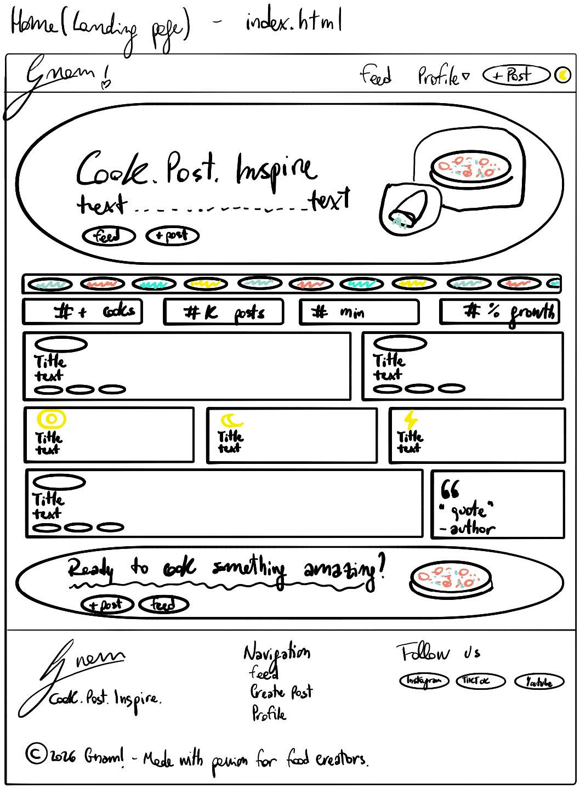
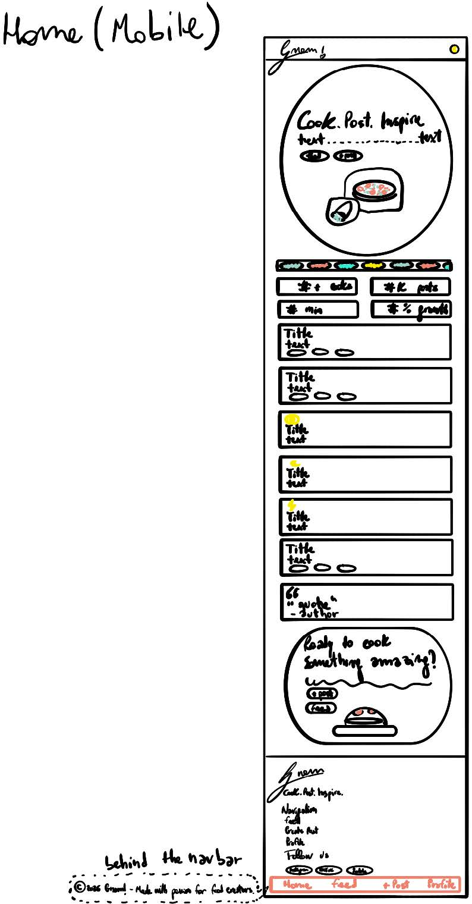
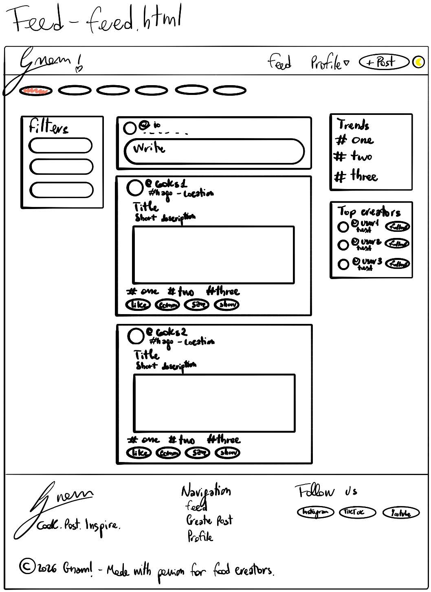
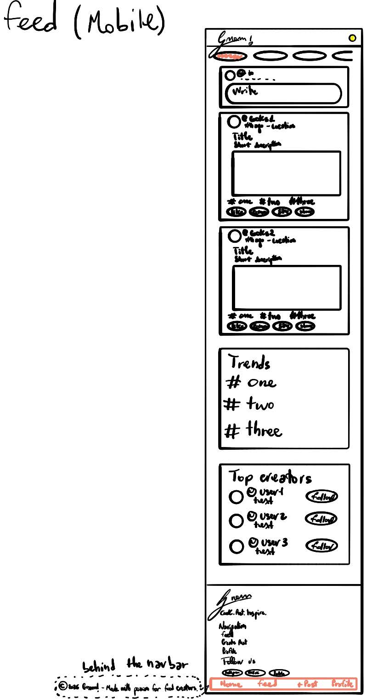
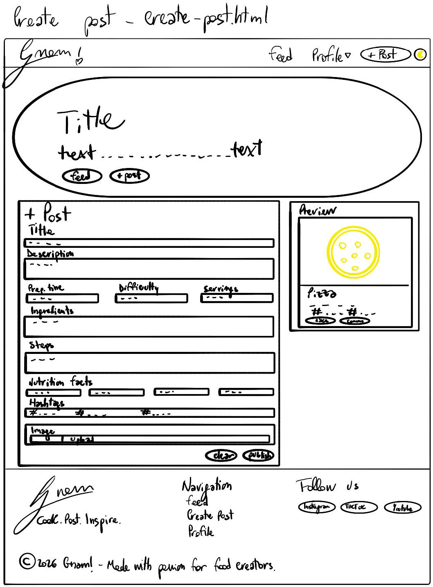
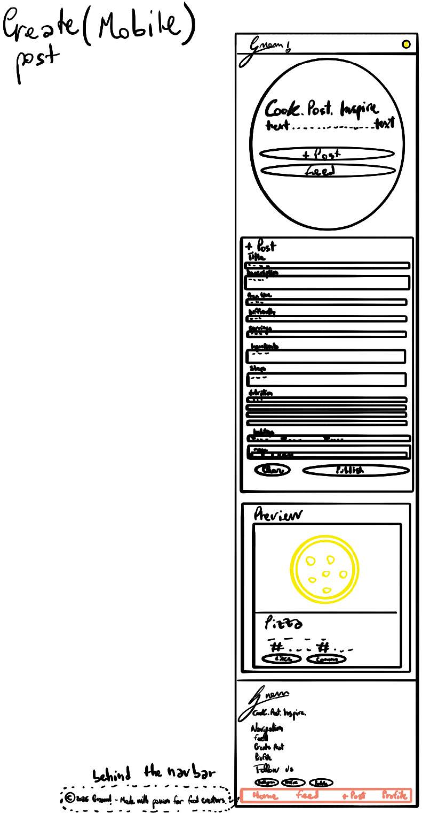
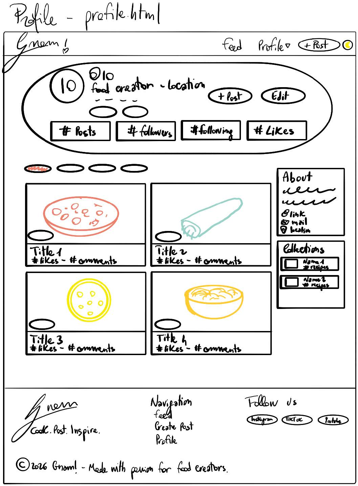
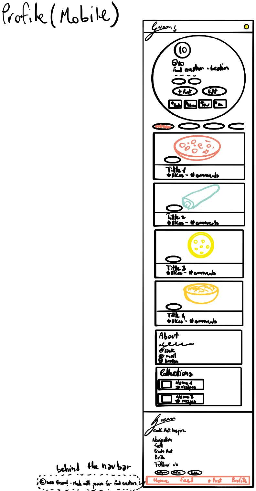
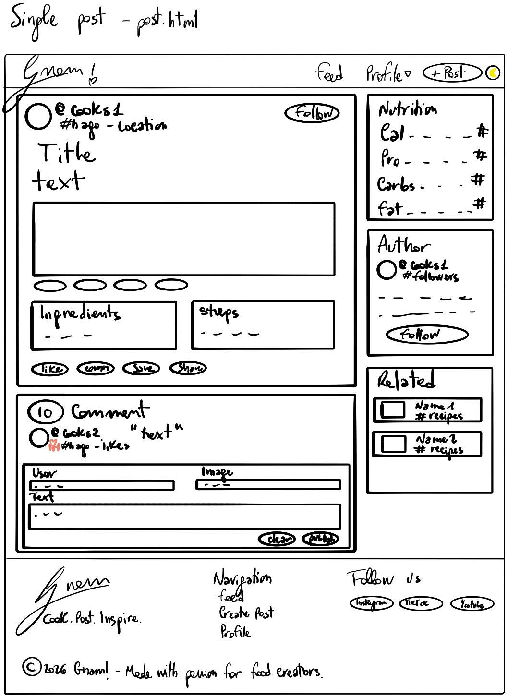
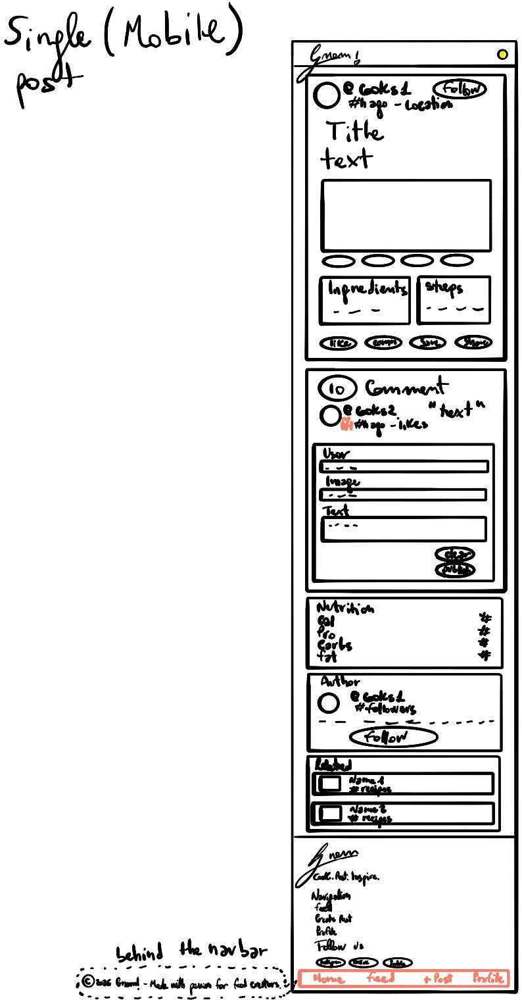

[](https://classroom.github.com/a/R5N_JGjf)
# Midterm Assignment Template

**Course:** 01VRP: Introduction to Web Applications (2025/2026)

## Student Information

- **Name:**  Giovanni Lorè
- **Student ID:**  322424

## Proposal

The redesign proposal was to transform the original lab prototype into a modern, visually consistent, mobile-friendly social platform for food creators called **Gnam!**. No more flat, boring recipes scattered on blogs but an immersive, app-like experience. The visual identity is made young and fun, with a bright custom palette centered on a lively brand orange.
To achieve this look, the interface is loaded with glassmorphism, soft shadows, and fluid microinteractions. Browsing recipes should be a feast for the eyes and easy to use, yet intuitive, so users will be motivated to cook, post, and inspire.
I used a storytelling approach: landing page for product narrative, feed for discovery, post page for details and interaction, profile page for creator identity, and create-post page for content publishing.

## Main Changes

Compared to the lab-session version, the following changes were introduced:

**Advanced CSS Styling and Architecture**: Using CSS variables (:root), I have built color schemes, typography, and spacing that can be very easily updated later. Visual effects applied to the navigation bar and content cards to make the User Experience and the User Interface look more appealing.

**Mobile-First App-like Navigation**: I have completely changed how the mobile experience works. For devices with a screen width of less than 768px, the usual top navigation menu turns into a fixed bottom tab bar (.navbar-mobile), thus very closely matching the user-friendliness of native iOS and Android apps.

**Custom Animations & Interactivity**: Added visually pleasing smooth @keyframes animations to give users quick and clear visual responses.  This includes staggered reveal effects for elements as they enter in the viewing area (.reveal.reveal-delay-*), change of states upon hovering in the user interaction, and an endless scrolling HTML ticker showcasing the latest hashtags on the homepage.

**Complex Multi-page Layouts**: The pages are strongly grid-oriented following the Bootstrap 5 guidelines as well as the additional use of CSS Grid/Flexbox sidebars for the layout, sticky elements, and highly sophisticated content placement. Additionally, the Bootstrap elements have been customized.

**Background Lighting Effects**: I have used a combination of fixed and floating divs (.bg-effect) with heavy blur filters to produce background lights that provide a nice ambiance.

## Deployment URL

```text
https://oigrol.github.io/Gnam---Social-Food-Project/
```

## Hand-Drawn Sketch

Include below **one image of a hand-drawn sketch**, produced before starting the implementation, showing the layout or interface idea you planned to develop.

This pdf contains all the sketches.
[Hand-drawn sketch](Sketch.pdf)

Additionally, each sketch is available here in both desktop and mobile versions:
















## Project Structure

List the main files included in your submission.

- `index.html`
- `feed.html`
- `create-post.html`
- `profile.html`
- `post.html`
- `style.css`

## Additional Notes

This project is implemented as a **static front-end prototype**: buttons and placeholder links only simulate interaction, there is no actual backend logic connected. External resources are loaded via CDN (Bootstrap, Bootstrap Icons, Google Fonts, Google Material Symbols). It also makes use of heavy custom CSS overrides to give life to the distinctive "Gnam!" brand identity.
